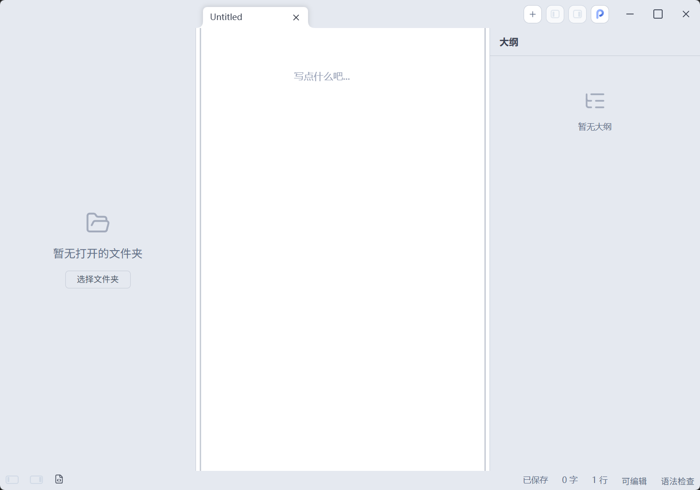
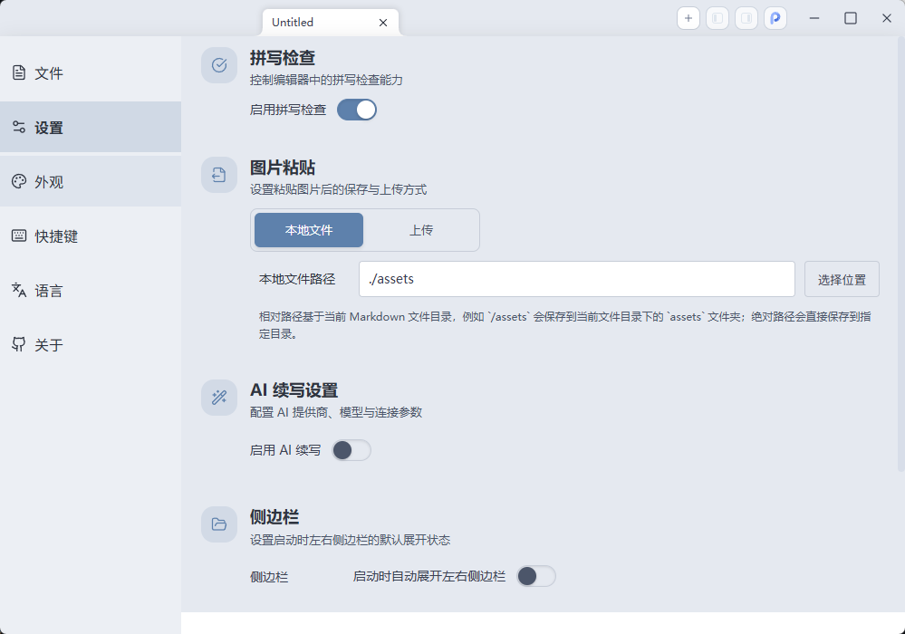

<div align="center">
  
  <h1>PureMark</h1>
  <p><strong>基于 Tauri + Vue 3 + 自研 ProseMirror 内核的跨平台 Markdown 编辑器</strong></p>

[](https://opensource.org/licenses/MIT)
[](https://nodejs.org/)
[](https://github.com/nianliu-jj/PureMark/releases)


</div>

## 项目简介

简墨（PureMark）是一个桌面端 Markdown 编辑器，目标是提供接近 Typora 的即时渲染体验，同时保留源码编辑、多标签页、多窗口、主题定制、图片上传和导出能力。

当前桌面运行时统一采用 Tauri 架构。

## 主要特性

- 即时渲染与源码模式切换
- 多标签页与多窗口 Tab 分离/合并
- 本地文件打开、保存、另存为与工作区浏览
- 本地图片保存、自定义图床上传与图片路径自动解析
- 主题系统、字体配置与快捷键自定义
- 拼写检查、文档大纲
- HTML / PDF / Word 导出
- Windows、macOS、Linux 跨平台支持

## 演示图片





## 开发环境

- Node.js >= 20.17.0
- pnpm >= 10
- Rust 工具链

## 本地开发

```bash
pnpm install
pnpm run dev
```

`pnpm run dev` 会启动 Tauri 开发环境，前端由 Vite 提供热更新。

## 构建应用

```bash
pnpm run build
```

如需直接调用 Tauri CLI：

```bash
pnpm run tauri:dev
pnpm run tauri:build
```

## 代码质量

```bash
pnpm run lint
pnpm run format
```

## 提交前建议

- 优先保持中文文案与注释风格一致
- 新的渲染层系统能力请优先接入 `src/services/api/`
- 桌面端能力统一通过 `src-tauri/` 与 `src/services/api/` 接入，不要新增旧宿主层旁路实现
- UI 通用组件统一放在 `src/components/ui/`
- 影响编辑器、多窗口、文件系统、图片处理、更新器的改动，请至少做一轮手工回归

## 提交规范

仓库会通过 `scripts/verify-commit.js` 校验提交信息，请使用如下前缀：

- `feat`
- `fix`
- `docs`
- `refactor`
- `perf`
- `test`
- `chore`
- `build`
- `ci`
- `style`
- `types`
- `workflow`
- `release`

## Pull Request

- 说明修改目标和影响范围
- 标明是否做过手工验证，以及验证范围
- 如果涉及 UI 或交互变化，尽量附上截图或录屏
